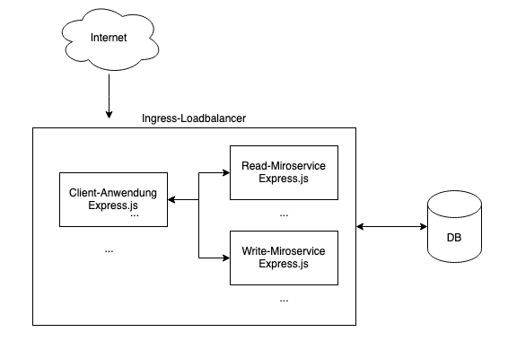
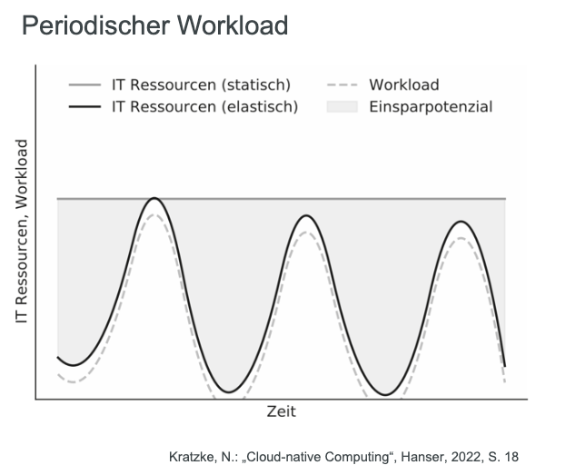

# Cloud 2023: Maximilian Bröker () und Jonas Acker (1458459)
---
## Aufgabenteil Prof. Pfisterer
### Zielsetzung und Beschreibung der Anwendung
Ziel ist es, eine Webanwendung zu realisieren, mit der QR-Codes als Gutscheine realisiert werden können.
Hierbei kann ein neuer Gutscheincode mit folgenden Metadaten angelegt werden:
 - Typ (bspw. Essen, Trinken etc.)
 - Wert
 - Name
Diese Metadaten, der Code-Inhalt an sich sowie die Information ob der Code noch gültig oder bereits entwertet ist, sollen in einer Datenbank gespeichert werden.
Im zweiten Teil der Webanwendung kann ein solcher QR-Code gescannt und dadurch alle oben genannten Metadaten abgerufen werden. Hierbei wird auch geprft, ob der Code noch gültig ist oder bereits eingelöst wurde. 
---
### Architektur
Die Anwendung wird als cloud-native Anwendung realsiert und verfolgt die in der folgenden Abbildung dargestellte Architektur.

Da mehr lesende als schreibende Zugriffe auf die Applikation erwartet werden, wird lesender und schreibender Service bewusste getrennt, um eine möglichst ressourceneffiziente Skalierung zu ermöglichen.

Skalierung der DB: Master Slave (lesend, da mehr lesende als schreibende Zugriffe)
Automatisches upscaling und downscaling, anhand welcher Metrik?
https://farberg.de/talks/cloud/?03d%20-%20Monitoring%20and%20Scalability.md#/21

Weshalb key value datenbank und keine relationale?

---
## Aufgabenteil Prof. Sturm
Im Folgenden werden auf Basis der im Aufgabenteil von Prof. Pfisterer realisierten Webapplikation die Aufgabenstellungen von Prof. Sturm beantwortet.

#### Welche Vorteile und Nachteile ergeben sich für Ihre Anwendung aus der Realisierung als Cloud-Native? Zeigen Sie dabei auch alternative Realisierungsmöglichkeiten auf, stellen Sie diese der Cloud-Native Lösung gegenüber und erörtern Sie kritisch.

Cloud-Native-Anwendungen bieten eine Vielzahl von Vorteilen, aber auch einige potenzielle Nachteile im Vergleich zu traditionellen On-Premise-Anwendungen. 
Im Folgenden werden zunächst die Vor- und Nachteile einer CLoud Applikation aufgeführt und anschließend auf den konrekten Anwendungsfall transferriert. 

**Vorteile von Cloud-Native-Anwendungen:**

    Skalierbarkeit: Cloud-Native-Anwendungen können problemlos skaliert werden, um mit variablen Workloads umzugehen, da Cloud-Dienste in der Regel elastische Skalierbarkeit bieten.

    Hohe Verfügbarkeit: Durch die Nutzung von Cloud-Diensten können Anwendungen so konfiguriert werden, dass sie eine hohe Verfügbarkeit gewährleisten, indem sie über mehrere Regionen und Rechenzentren verteilt werden.

    Flexibilität: Cloud-Native-Anwendungen sind flexibel und anpassungsfähig, da sie es Entwicklern ermöglichen, verschiedene Services und Technologien je nach Bedarf zu verwenden, ohne sich auf spezifische Hardware oder Software festlegen zu müssen.

    Automatisierung: Cloud-Native-Technologien ermöglichen eine umfassende Automatisierung von Bereitstellung, Skalierung, Wartung und anderen Aspekten des Betriebs, was die Effizienz erhöht und menschliche Fehler reduziert.

    BEssere Ausnutzung von Ressourcen, da viele Applikationena auf dem selben physischen Server laufen 

    Bei einem hohen peak-to-average-verhältnis sind Cloud-Anwendungen günstiger als on-premise.
    Dies ist bei periodischen Workloads der Fall. Ein Beispiel hierfür wäre ein Bezahlsystem in einer Kantine. Dieses ist periodisch zu Essenszeiten (9 Uhr, 12 Uhr) ausgelastet.
    

**Nachteile von Cloud-Native-Anwendungen:**

    Kosten: Cloud-Native-Anwendungen können aufgrund von laufenden Gebühren für Cloud-Ressourcen und -Dienste teurer sein als lokale Lösungen, insbesondere wenn die Skalierung nicht optimiert ist.

    Komplexität: Die Integration und das Management mehrerer Cloud-Services können komplex sein und erfordern spezifisches Fachwissen, was den Entwicklungs- und Betriebsaufwand erhöht.

    Abhängigkeit von Anbietern: Cloud-Native-Anwendungen sind stark von den Funktionen und der Leistung der Cloud-Provider abhängig, was zu potenziellen Einschränkungen und Vendor-Lock-in-Risiken führen kann.

    Insiderangriff: Administratoren der Cloud-Provider könnten umfangreichen Zugriff auf Daten haben. Dies birgst vspw. das Risiko der Wirtschaftsspinonage. 

**Transfer auf unsere Anwendung**
Die Anwendung um Gutscheine zu erstellen und zu prüfen kann insbesondere durch die Skalierbarkeit in der Cloud profitieren. So können dynamisch Ressourcen hinzugefügt werden, wenn die Anwendung eine stärkere Nutzung erfährt. Dies ist bei dem dargestellten Anwendungsfall der Webapplikation sehr wahrscheinlich der Fall, da bspw. vermehrt Codes gescannt werden, wenn eine Verantaltung stattfindet.

Alternative Realisierungsmöglichkeiten:

    On-Premise-Lösungen: Traditionelle On-Premise-Anwendungen bieten direkte Kontrolle über Hard- und Software, sind jedoch oft teurer in der Wartung und Skalierung.

    Hybridlösungen: Hybridlösungen kombinieren lokale Infrastruktur mit Cloud-Services und ermöglichen eine flexible Skalierung und Integration, können aber die Komplexität der Umgebung erhöhen.

    Containerisierung: Die Verwendung von Containern, z. B. mit Docker, ermöglicht eine konsistente Bereitstellung und Portabilität von Anwendungen, kann jedoch auch komplexe Orchestrierung erfordern.

Die Entscheidung für Cloud-Native-Lösungen erfordert eine sorgfältige Abwägung der spezifischen Anforderungen des Projekts sowie der langfristigen Geschäftsziele. Während Cloud-Native-Ansätze Skalierbarkeit und Flexibilität bieten, können Kosten und Komplexität potenzielle Herausforderungen darstellen, die berücksichtigt werden müssen. Es ist ratsam, die Infrastruktur- und Betriebskosten über den gesamten Lebenszyklus hinweg zu berücksichtigen und die Abhängigkeit von einem einzelnen Cloud-Anbieter kritisch zu prüfen, um potenzielle Risiken zu minimieren.

#### Wie gewährleisten Sie die Datensicherheit? Bewerten Sie dabei auch die Relevanz der DSGVO für Ihre Anwendung.

Es ist esentiell die Datensicherheit im gesamten Lebenszyklus der Daten sicherzustellen,
Dieser setzt sich aus folgenden Phasen zusammen:
 - Erzeugung
 - Übertragung
 - Benutzung
 - Speicherung
 - Archivierung
 - Löschung

Um die Datensicherheit zu gewährleisten, sind auch in Cloud-Native-Anwendung verschiedene Maßnahmen erforderlich. 
Diese können nach folgenden Kategorien gruppiert werden:
 - **Vertraulichkeit: Nur berechtigte Personen sollten Zugriff haben**
 - **Integrität: Schutz vor unberechtigter Manipulation**
 - **Verfügbarkeit: Verfügbarkeit der Daten**
 - **Authentizität: Galubwürdigkeit der Datenherkunft**
 - **Besitz: Besitz der Daten und Entscheidung über Zugang**
 - **Nützlichkeit: Verfügbarkeit der Daten in nutzbarer Form**

Das Grundprinzip der DSGVO stellt das Verbot der Verarbeitung von personenbezogenen Daten dar. 
Müssen personenbezogene Daten verarbeitet werden, setzt dies die Einwilligung des Betroffenen voraus. Selbst mit Einwilligung des betroffenen gelten weiterhin folgende Grundsätze:
    1. Rechtmäßigkeit, Verarbeitung nach Treu & Glauben und Transparenz: Die Verarbeitung personenbezogener Daten muss rechtmäßig, fair und transparent gegenüber den betroffenen Personen erfolgen.

    2. Zweckbindung: Personenbezogene Daten dürfen nur für festgelegte, eindeutige und rechtmäßige Zwecke erhoben werden und dürfen nicht in einer mit diesen Zwecken nicht zu vereinbarenden Weise weiterverarbeitet werden.

    3. Datenminimierung (auch Minimalprinzip genannt): Die Datenverarbeitung muss auf das für die Zwecke, für die die personenbezogenen Daten verarbeitet werden, notwendige Maß beschränkt sein.

    4. Richtigkeit: Personenbezogene Daten müssen sachlich richtig und erforderlichenfalls auf dem neuesten Stand gehalten werden. Es sind alle angemessenen Maßnahmen zu treffen, um unrichtige personenbezogene Daten unverzüglich zu berichtigen oder zu löschen.

    5. Speicherbegrenzung: Personenbezogene Daten müssen in einer Form gespeichert werden, die die Identifizierung der betroffenen Personen nur so lange ermöglicht, wie es für die Zwecke, für die sie verarbeitet werden, erforderlich ist.

    6. Integrität und Vertraulichkeit: Personenbezogene Daten müssen so verarbeitet werden, dass eine angemessene Sicherheit gewährleistet ist, einschließlich Schutz vor unbefugter oder unrechtmäßiger Verarbeitung und vor unbeabsichtigtem Verlust, unbeabsichtigter Zerstörung oder unbeabsichtigter Schädigung, durch geeignete technische oder organisatorische Maßnahmen.

 Der Verantwortliche der Datenspeicherung ist für die Einhaltung dieser Grundsätze verantwortlich und muss dies nachweisen können (Rechenschaftspflicht).

 Werden personenbezognene in einer Cloud gespeichert, so muss ein Auftragdatenvereinbarungsvertrag geschlissenw erden, da die Daten dann bei Dritten (dem Cloud-Anbieter) gespeichert werden. Des Weiteren ist darauf zu achten, dass das Spannungsfeld zwischen global verteilen Ressourcen von Cloud-Anbietern und lokalen Datenschutzgesetzen beachtet wird. 

**Transfer auf unsere Anwendung**

