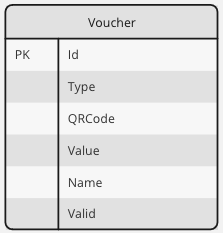
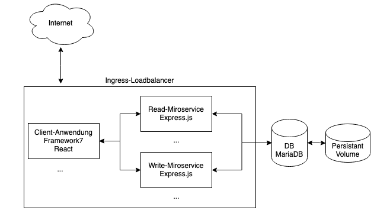
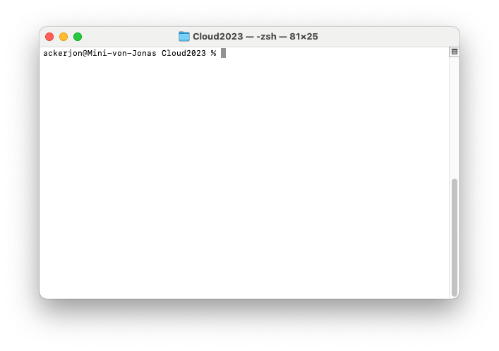
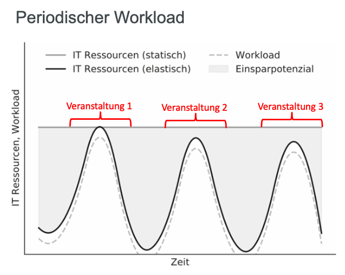

## W3M20035 Cloud Infrastructures and Cloud Native Applications
## Prüfungsleistung Laborbericht
#### Maximilian Bröker (5800049) und Jonas Acker (1458459) 
---
## Aufgabenteil Prof. Pfisterer
### Zielsetzung der Anwendung
Im Rahmen der Projektarbeit wurde eine Webanwendung umgesetzt, mit der Gutscheine in Form von QR-Codes generiert und eingelöst werden können. Das Ziel der Anwendung ist es, kleinen bis mittelgroßen Veranstaltern (wie beispielsweise Vereinen) eine intuitive und komfortable Lösung zu bieten, digitale Wertmarken für Veranstaltungen zu verwalten. Die Anwendung soll einfach abrufbar und mobil verfügbar sein, um auf den Events vor Ort zum Einsatz zu kommen. Außerdem soll die Archtitektur der Anwendung über ihre Skalierbarkeit berücksichtigen, dass ohne großen Aufwand neue Veranstalter hinzu genommen werden können. Es ist des Weiteren notwendig, dass einzelne Teile der Anwendung besonders zu Zeiten mit hohem Anfragevolumen, wie beispielsweise an den Abenden am Wochenende, bei höherer Last performant bleiben. 

Über die Anwendung soll es einerseits für Veranstalter möglich sein, neue Gutscheine auszugeben. Dazu soll es eine Funktion geben, die Gutscheine generiert und in einer Datenbank speichert. Es soll außerdem möglich sein, diese Gutscheine anschließend auf den Client herunterzuladen, um sie später einlösen zu können.
Bei der Anlage soll ein neuer Gutscheincode mit folgenden Metadaten angelegt werden:
 - Typ (bspw. Essen, Trinken etc.)
 - Wert
 - Name

Diese Metadaten, der Inhalt des QR-Codes (Zufalls-String) sowie die Information ob der Code noch gültig oder bereits entwertet ist, sollen in einer Datenbank abgelegt werden.

Im zweiten Teil der Webanwendung soll es möglich sein, den Gutschein über den heruntergeladenen QR Code abzurufen. Hierbei sollen die Informationen des Gutscheins geladen werden und es soll auch auch geprüft werden, ob der Code noch gültig ist oder bereits eingelöst wurde. Sollte der Gutschein noch gültig sein, soll es hier eine Möglichkeit zur Entwertung des Gutscheins geben. Den Veranstaltern soll damit eine Möglichkeit geboten werden, die Gutscheine an Verkaufsstellen entgegenzunehmen. 
 
Um die Zielsetzung zu erreichen, muss die Datenbank folgendes Datenbankschema realisieren.
 

---
### Architektur und Entwurf der Anwendung
Die Anwendung wird als cloud-native Anwendung realisiert und verfolgt die in der folgenden Abbildung dargestellte Architektur.

**Frontend (client)**
 
Das Frontend wurde mit dem Open-Source-Framework Framework7 und React.js realisiert (https://framework7.io/react/). Durch die eingebauten UI-Komponenten und -Layouts in Framework7 konnten eine ansprechende Anwendung mit benutzerfreundlichen Interaktionsmöglichkeiten erstellt werden. Die F7-React-Anwendung besteht aus 2 Pages, zwischen denen über die Navigationsleiste am unteren Bildschirmrand gewechselt werden kann:

Creation: 
Die Page Creation bietet den Veranstaltern die Möglichkeit, neue Gutscheine anzulegen. Dazu können über ein Formular der Typ und der Wert des Gutscheins festgelegt werden, sowie der Name der Person angegeben werden, auf die der Gutschein ausgestellt werden soll. Über den "Create Voucher Button" wird dann ein Gutschein mit den angegeben Metadaten angelegt. Dazu wird mithilfe des HTTP-Clients Axios der Write-Service gerufen (https://github.com/axios/axios).
Damit der Gutschein auch durch den Nutzer abgespeichert und später eingelöst werden kann, wird aus dem zufällig generierten Gutscheincode ein QR-Code erstellt, der über die Seite heruntergeladen werden kann. Um den QR-Code zu generieren wird die react-qr-code Library verwendet (https://www.npmjs.com/package/react-qr-code).

Redemption:
Die Page Redemption dient dazu, Gutscheine einzulesen und sie zu entwerten. Für das Einlesen des Gutscheins wurde auf der linken Seite der Page ein QR-Code-Scanner platziert, der mithilfe der react-qr-reader Komponente umgesetzt wurde (https://www.npmjs.com/package/react-qr-reader). Nach dem Scan wird ebenfalls Axios genutzt um einen HTTP Call zu erzeugen. Mit diesem wird der Read Service gerufen, um die Informationen zu dem Gutschein auszulesen. Diese werden anschließend auf der rechten Seite der Page angezeigt. Ist der Gutschein noch gültig, so gibt es die Möglichkeit, ihn einzulösen. Dies wurde über einen zusätzlichen Endpoint im Write Service umgesetzt. 

**Services (services)**
 Das Backend in Form von zwei Services basiert auf Node.js als Laufzeitumgebung. Somit erfolgt die Implementierung in JavaScript. Um grundlegende Funktionen nicht selbst programmieren zu müssen, wird das Framework Express für die Erstellung der Services verwendet. 

Da mehr lesende als schreibende Zugriffe auf die Applikation erwartet werden, wird lesender und schreibender Service bewusste getrennt, um eine möglichst ressourceneffiziente Skalierung zu ermöglichen. Dies folgt somit dem Architekturmuster von Microservices, bei dem Anwendungen in kleinere, unabhängige und lose gekoppelte Dienste aufgeteilt werden, die jeweils spezifische Funktionen erfüllen. Diese Dienste können unabhängig voneinander entwickelt, bereitgestellt und skaliert werden. Eine mögliche Metrik für die Skalierung der Services wäre die Auslastung der CPU oder die Response Time. 

Read-Service: 
Der Read-Service stellt die Endpunkte für lesende Operationen auf die Datenbank bereit. Er wurde bewusst von den schreibenden Operationen getrennt, da es zu Zeiten einer Veranstalung wahrscheinlich zu besonders vielen lesenden Zugriffen kommt. Der Read-Service stellt den Enpoint "/getvoucher/:id" bereit, mit dem über den Gutscheincode die Daten eines Gutscheins im JSON-Format zurückgegeben werden. Die empfangenen Anfragen des Frontends verarbeitet er und leitet sie an die Datenbank (MariaDB) weiter.

Write-Service: 
Der Write-Service stellt die Endpunkte für schreibende Operationen auf die Datenbank bereit. Über den Enpoint "/postvoucher" können über JSON neue Gutscheine angelegt werden. Über den Endpunkt "/redeem/:code" können Gutscheine mit ihrem Code als Parameter eingelöst und damit auf ungültig gesetzt werden.

**Datenbank (database)**
 Für die Anwendung wird eine MariaDB genutzt, welche die Daten über ein Persistent Volume speichert. 
Bei der Skalierung der Anwendung ist es von Bedeutung, auch die Datenbank mitzubedenken. Da bei der Anwendung mehr lesende als schreibende Zugriffe erwartet werden, kann das Prinzip der Master-Slave-Replikation angewendet werden. 
Bei der Master-Slave-Replikation handelt es sich um einen Prozess in einer Datenbankumgebung, bei dem Datenbanktransaktionen (Änderungen an Daten) von einem Master-Datenbankserver auf einen oder mehrere Slave-Server repliziert werden. Dieses Verfahren bietet die Möglichkeit, Leselast von einem Master-Server auf Slave-Server zu verteilen und gleichzeitig Redundanz und Fehlertoleranz zu gewährleisten.
Die im Rahmen dieser Anwendung genutzte Datenbank MariaDB unterstützt ein Master-Slave-Prinzip, wenngleich dieses durch die beschränkte Bearbeitungszeit nicht implementiert wurde. 
Neben der Skalierung nach dem Maser-Slave Prinzip können auch Caching-Mechanismen eingesetzt werden, um die Last auf der Datenbank zu reduzieren. Die Verwendung von Caching-Technologien wie Memcached oder Redis kann die Leistung verbessern, indem häufig abgerufene Daten zwischengespeichert werden, um die Anzahl der Datenbankabfragen zu reduzieren.

**Kubernetes Konfiguration (k8s-config)**
 Um die verschiedenen Komponenten der Anwendung zu orchestrieren und ein Deployment in einer Cloud Infrastruktur zu ermöglichen wurden Kubernetes Ressourcen mithilfe von yaml-Dateien konfiguriert. Zu Entwicklungszwecken wurde mithilfe von minikube ein lokaler Kubernetes Cluster gestartet, auf dem die Ressourcen deployed werden konnten (https://minikube.sigs.k8s.io/docs/). Um das entwickelte Frontend und die Service zusammen mit ihren Abhängigkeiten nutzen zu können, wurden für sie jeweils ein Dockerfile erstellt, mit dem ein Image im Minikube Docker Directory gebildet werden kann. Die Kubernetes Konfiguration umfasst die folgenden Ressourcen: 

Frontend:
- Deployment für die Framework7 React App
- Service für das Frontend

Services:
- Deployment für den Express.js Read-Service
- Service für den Read-Service
- Deployment für den Express.js Write-Service
- Service für den Write-Service

Datenbank:
- Deployment für die MariaDB Datenbank
- Service für die MariaDB Datenbank
- Persistant Volume Claim für die Datenbank

Weiteres:
- Ingress zur Verwaltung des Networkings und um die Services extern zu exposen
- Horizontal Pod Autoscaler (HPA) um die Skalierbarkeit einzelner Ressourcen zu demonstrieren
- Deployment für Load-Test, um mithilfe von Test-Workload das Autoscaling auszulösen

### Herausforderungen und kritische Reflexion
Da der Entwurf der Anwendung vorsieht, Frontend und Backend einerseits logisch voreinenader zu trennen und andererseits auf Basis verschiedener Technologien zu implementieren, hat sich die Kommunikation zwischen Backend und Frontend als größte Herausforderung dargestellt. So war es herausfordernd, die Netzwerkkommunikation zwischen den Pods für Frontend und Backend aufzubauen. Hier war der Einsatz des Ingress entscheidend, über den die genauen Pfade definiert werden konnten, unter denen die jeweiligen Services erreicht werden können. 

Im Rahmen des Projektes konnte die geplante Anwendung mit den wichtigsten Funktionalitäten implementiert werden. Mögliche Schritte, um die Anwendung weiterzuentwickeln wäre die Identifikation geeigneter Metriken für die Skalierung der einzelnen Komponenten und deren Überwachung in einem Monitoring. Desweiteren wäre es unter dem Aspekt des Datenschutzes sinnvoll, sensitive Daten (wie die Zugangsdaten zur DB) in Secrets abzubilden. 

### Screencast Deployment der Anwendung und Demo-Case

---
## Aufgabenteil Prof. Sturm
Im Folgenden werden auf Basis der im Aufgabenteil von Prof. Pfisterer realisierten Anwendung die Aufgabenstellungen von Prof. Sturm beantwortet.

### Welche Vorteile und Nachteile ergeben sich für Ihre Anwendung aus der Realisierung als Cloud-Native? Zeigen Sie dabei auch alternative Realisierungsmöglichkeiten auf, stellen Sie diese der Cloud-Native Lösung gegenüber und erörtern Sie kritisch.

Cloud-Native-Anwendungen bieten eine Vielzahl von Vorteilen, aber auch einige potenzielle Nachteile im Vergleich zu traditionellen On-Premise-Anwendungen. 
Im Folgenden werden zunächst die Vor- und Nachteile aufgeführt, die sich durch die Umsetzung der Voucher-Hub Anwendung als Cloud-Native ergeben und anschließend mit alternativen Lösungsansätzen verglichen.

**Vorteile von Cloud-Native-Anwendungen:**

**Skalierbarkeit:**
 Cloud-Native-Anwendungen können problemlos skaliert werden, um mit variablen Workloads umzugehen, da Cloud-Dienste in der Regel elastische Skalierbarkeit bieten.
Für die Gutschein-App ist dies von großem Vorteil. Die Zugriffe auf die Anwendung werden vor allen dann hoch sein, wenn gerade eine Veranstaltung stattfindet. Damit wird die Last besonders an Wochenenden hoch sein, während sie zwischen den Veranstaltungen eher niedriger ist. Als Cloud-Native Anwendung verfügt die App über die passende Elastizität und kann für die Stoßzeiten mehr Kapazitäten zur Verfügung stellen, diese aber auch zwischen den Veranstaltungen wieder herunterfahren. Die folgende Abbildung skizziert dieses Verhalten:

Quelle: In Anlehnung an Kratzke, N.: "Cloud-native Computing", Hanser, 2022, S.18

**Hohe Verfügbarkeit:**
 Durch die Nutzung von Cloud-Diensten können Anwendungen so konfiguriert werden, dass sie eine hohe Verfügbarkeit gewährleisten, indem sie über mehrere Regionen und Rechenzentren verteilt werden. Damit wäre es möglich, die Anwendung weltweit performant anzubieten, da sie auf unterschiedliche Rechenzentren verteilt werden kann. Man muss sich also nicht auf Veranstaltungen in einer geografischen Region spezialisieren.
Die Anwendung kann außerdem direkt über den Browser aufgerufen werden und ist damit auch mobil verfügbar, was ihre Einsatzmöglichkeit nochmals erhöht. 

**Flexibilität:**
 Cloud-Native-Anwendungen sind flexibel und anpassungsfähig, da sie es Entwicklern ermöglichen, verschiedene Services und Technologien je nach Bedarf zu verwenden, ohne sich auf spezifische Hardware oder Software festlegen zu müssen. Durch die Kapselung der einzelnen Ressourcen in Docker Containern kann die Anwendung leicht von einem Host auf den anderen Host umgezogen werden, falls dies benötigt wird. Aufrgund der Microservices Archtiktur und der Trennung der Ressourcen auf eigene Deployments kann in der Entwicklung außerdem separat an den Teilen der Anwendung gearbeitet werden, was eine effizientere Implmentierung neuer Funktionen ermöglicht. 

**Automatisierung:**
 Cloud-Native-Technologien ermöglichen eine umfassende Automatisierung von Bereitstellung, Skalierung, Wartung und anderen Aspekten des Betriebs, was die Effizienz erhöht und menschliche Fehler reduziert. So wurde in der App besipielsweise ein Autoscaler implementiert, der je nach Workload die Services für lesende Zugriffe repliziert um eine performante Antwortzeit der Anwendung sicherzustellen. 

Abschließend bleibt bei den Vorteilen durch die Cloud-native Implementierung hervorzuheben, dass sich diese vor allem durch das hohe peak-to-average-Verhältnis günstiger als eine on-premise Lösungen darstellt. Dies entsteht durch die periodischen Workloads. 
Bei einer produktiven Implementierung wäre jedoch darauf zu achten, dass ein geeignetes Preismodell des Cloud-Anbieters gewählt wird, welches entsprechend dem Workload abrechnet. 

**Nachteile von Cloud-Native-Anwendungen:**

**Kosten:** 
Cloud-Native-Anwendungen können aufgrund von laufenden Gebühren für Cloud-Ressourcen und -Dienste teurer sein als lokale Lösungen, insbesondere wenn die Skalierung nicht optimiert ist. Da in unserer App Autscaling implementiert ist muss darauf geachtet werden, passende Metriken zu verwenden um nicht unnötige Ressourcen bereitzustellen. Auch das Abrechnungsmodell des Cloud-Providers muss sorgfältig geprüft und passend zur Anwendung ausgewählt werden. 

**Komplexität:**
 Die Integration und das Management mehrerer Cloud-Services können komplex sein und erfordern spezifisches Fachwissen, was den Entwicklungs- und Betriebsaufwand erhöht. Bereits in der im Rahmen der Projektarbeit implementierten Version sind viele unterschiedliche Komponenten enthalten, obwohl diese nur die Grundfunktionalität der Anwendung abdeckt. In einer umfangreicheren Implementierung kann die Orchestrierung, Wartung und Weiterentwicklung der einzelnen Komponenten zu einer Herausforderung werden. 

**Abhängigkeit von Anbietern:**
 Cloud-Native-Anwendungen sind stark von den Funktionen, der Leistung und SLAs der Cloud-Provider abhängig, was zu potenziellen Einschränkungen und Vendor-Lock-in-Risiken führen kann. Wenn es beispielsweise Serverprobleme beim Cloud-Provider während eine Veranstaltung gibt, hat man kaum Möglichkeiten sich selbst um diese Probleme zu kümmern und muss auf den Support des anbieters warten. 

**Datenhoheit:**
 Da in diesem Fall die gesamte Anwendung in der Cloud deployed wird, liegen nicht nur die Daten sondern auch der Quellcode auf den Servern des Cloud-Anbieters. Administratoren der Cloud-Provider könnten umfangreichen Zugriff darauf haben. Dies birgst bspw. das Risiko der Wirtschaftsspionage. Dass die Daten auf den Servern eines Hyperscalers leigen könnte des Weiteren einen Teil der Kunden abschrecken, die sensibel auf die Speicherung ihrer personenbezogenen Daten reagieren. 

### Alternative Realisierungsmöglichkeiten:

**On-Premise-Lösungen:**
 Traditionelle On-Premise-Anwendungen bieten direkte Kontrolle über Hard- und Software, sind jedoch oft teurer in der Wartung und Skalierung. So hätte unsere Anwendung auch auf einem oder mehreren bare-metal Servern installiert werden können.

**Hybridlösungen:**
 Hybridlösungen kombinieren lokale Infrastruktur mit Cloud-Services und ermöglichen eine flexible Skalierung und Integration, können aber die Komplexität der Umgebung erhöhen. So hätte unsere Anwendung bspw. die Datenbank und die Backend-Services auf einem lokalen bare-metal Server aufgesetzt werden können, während das Frontend in der Cloud bereitgestellt wird. 

Die Entscheidung für Cloud-Native-Lösungen erfordert eine sorgfältige Abwägung der spezifischen Anforderungen des Projekts sowie der langfristigen Geschäftsziele. Während Cloud-Native-Ansätze Skalierbarkeit und Flexibilität bieten, können Kosten und Komplexität potenzielle Herausforderungen darstellen, die berücksichtigt werden müssen. Es ist ratsam, die Infrastruktur- und Betriebskosten über den gesamten Lebenszyklus hinweg zu berücksichtigen und die Abhängigkeit von einem einzelnen Cloud-Anbieter kritisch zu prüfen, um potenzielle Risiken zu minimieren.

### Wie gewährleisten Sie die Datensicherheit? Bewerten Sie dabei auch die Relevanz der DSGVO für Ihre Anwendung.
#### Datensicherheit
Es ist essentiell die Datensicherheit im gesamten Lebenszyklus der Daten sicherzustellen. 
Dieser setzt sich aus folgenden Phasen zusammen: 
 - Erzeugung
 - Übertragung
 - Benutzung
 - Speicherung
 - Archivierung
 - Löschung

Um die Datensicherheit zu gewährleisten, sind auch in Cloud-Native-Anwendung verschiedene Maßnahmen erforderlich. 
Die folgende Auflistung orientiert sich an der verbreiteten "Pakerian Hexad" (nach Donn B, Parker, 1998), welche sechs Attribute der IT-Sicherheit umfasst:
 - **Vertraulichkeit:** Nur berechtigte Personen sollten Zugriff haben
 - **Integrität:** Schutz vor unberechtigter Manipulation
 - **Verfügbarkeit:** Verfügbarkeit der Daten
 - **Authentizität:** Galubwürdigkeit der Datenherkunft
 - **Besitz:** Besitz der Daten und Entscheidung über Zugang
 - **Nützlichkeit:** Verfügbarkeit der Daten in nutzbarer Form

Im Folgenden werden gängige Techniken und Konzepte zur Einhaltung der Datensicherheit aufgeführt und erläutert.
Diese Best Practices sind essentiell, um die Datensicherheit in verschiedenen Kontexten zu gewährleisten. 

**Castle and Moat (Burg und Burggraben):**  
Diese Metapher steht für eine Sicherheitsstrategie, die darauf abzielt, ein robustes Verteidigungssystem um Daten und Ressourcen herum aufzubauen. Die "Burg" repräsentiert sensible Daten und Ressourcen, die durch verschiedene Sicherheitsmaßnahmen geschützt werden, wie Zugriffskontrollen, Verschlüsselung und Identitätsmanagement. Der "Burggraben" symbolisiert eine zusätzliche Schutzschicht, die es Eindringlingen erschwert, Zugang zu sensiblen Bereichen zu erhalten. Dies kann durch Firewalls, Intrusion Detection Systems und andere Sicherheitsmechanismen erreicht werden.

**Überwachung des Netzwerkverkehrs:** 
Die kontinuierliche Überwachung des Netzwerkverkehrs ist entscheidend, um potenzielle Sicherheitsverletzungen zu erkennen und darauf zu reagieren. Durch die Überwachung des Datenverkehrs können verdächtige Aktivitäten identifiziert, Angriffe erkannt und ungewöhnliche Muster im Datenfluss aufgedeckt werden. Dies ermöglicht es den Sicherheitsteams, proaktiv auf Bedrohungen zu reagieren und geeignete Gegenmaßnahmen zu ergreifen.

**Datensicherheit durch Verschlüsselung:** 
Die Verschlüsselung von Daten gewährleistet, dass selbst im Falle einer Kompromittierung des Systems der Inhalt für unbefugte Personen unleserlich bleibt. Durch die Verwendung von starken Verschlüsselungsalgorithmen können Daten sowohl während der Speicherung als auch während der Übertragung geschützt werden. Dies ist besonders wichtig, wenn vertrauliche Informationen über öffentliche Netzwerke oder in der Cloud übertragen werden.

**Zero Trust:** 
Die Zero-Trust-Sicherheitsstrategie basiert auf dem Konzept, dass keine Person oder kein Gerät im Netzwerk standardmäßig vertrauenswürdig ist. Dies bedeutet, dass alle Benutzer, Geräte und Anwendungen einer strengen Überprüfung unterzogen werden, bevor sie Zugriff auf Ressourcen erhalten. Durch die Implementierung von Zugriffsbeschränkungen, Identitätsüberprüfungen und anderen Sicherheitsmaßnahmen wird das Risiko von Sicherheitsverletzungen minimiert.

**Security Assessment:** 
Sicherheitsbewertungen umfassen regelmäßige Überprüfungen und Analysen der Sicherheitslage, um potenzielle Schwachstellen und Risiken zu identifizieren. Durch Sicherheitsbewertungen können Organisationen proaktiv Sicherheitslücken erkennen und geeignete Maßnahmen ergreifen, um ihre Sicherheitsinfrastruktur zu stärken. Dies beinhaltet oft Penetrationstests, Schwachstellenanalysen und Sicherheitsaudits.

#### Datenschutz-Grundverordnung (DSGVO)
Das Grundprinzip der DSGVO stellt das Verbot der Verarbeitung von personenbezogenen Daten dar. 
Müssen personenbezogene Daten verarbeitet werden, setzt dies die Einwilligung des Betroffenen voraus. Selbst mit Einwilligung des betroffenen gelten weiterhin folgende Grundsätze:
1. Rechtmäßigkeit, Verarbeitung nach Treu & Glauben und Transparenz: Die Verarbeitung personenbezogener Daten muss rechtmäßig, fair und transparent gegenüber den betroffenen Personen erfolgen.

2. Zweckbindung: Personenbezogene Daten dürfen nur für festgelegte, eindeutige und rechtmäßige Zwecke erhoben werden und dürfen nicht in einer mit diesen Zwecken nicht zu vereinbarenden Weise weiterverarbeitet werden.
   
3. Datenminimierung (auch Minimalprinzip genannt): Die Datenverarbeitung muss auf das für die Zwecke, für die die personenbezogenen Daten verarbeitet werden, notwendige Maß beschränkt sein.
   
4.  Richtigkeit: Personenbezogene Daten müssen sachlich richtig und erforderlichenfalls auf dem neuesten Stand gehalten werden. Es sind alle angemessenen Maßnahmen zu treffen, um unrichtige personenbezogene Daten unverzüglich zu berichtigen oder zu löschen.

5. Speicherbegrenzung: Personenbezogene Daten müssen in einer Form gespeichert werden, die die Identifizierung der betroffenen Personen nur so lange ermöglicht, wie es für die Zwecke, für die sie verarbeitet werden, erforderlich ist.

6. Integrität und Vertraulichkeit: Personenbezogene Daten müssen so verarbeitet werden, dass eine angemessene Sicherheit gewährleistet ist, einschließlich Schutz vor unbefugter oder unrechtmäßiger Verarbeitung und vor unbeabsichtigtem Verlust, unbeabsichtigter Zerstörung oder unbeabsichtigter Schädigung, durch geeignete technische oder organisatorische Maßnahmen.

Der Verantwortliche der Datenspeicherung ist für die Einhaltung dieser Grundsätze verantwortlich und muss dies nachweisen können (Rechenschaftspflicht). 
  
Werden personenbezogene in einer Cloud gespeichert, so muss ein Auftragsdatenvereinbarungsvertrag geschlossen werden, da die Daten dann bei Dritten (dem Cloud-Anbieter) gespeichert werden. Des Weiteren ist darauf zu achten, dass das Spannungsfeld zwischen global verteilen Ressourcen von Cloud-Anbietern und lokalen Datenschutzgesetzen beachtet wird. Manche Cloud-Anbieter teilen Ihre Cloud aus diesem Grund in Zonen ein, aus denen selektiert werden kann. So kann bspw. sichergestellt werden, dass eine Anwendung und deren Daten lediglich in Deutschland betrieben bzw. gespeichert werden. 

### Transfer auf unsere Anwendung

**Datensicherheit** 
In der vorliegenden Anwendung wurden keine expliziten Sicherheitsvorkehrungen getroffen, da es nie Ziel war die Anwendung bei einem Cloud-Provider zu hosten und aus dem Internet verfügbar zu machen. Bei einer möglichen Veröffentlichung der Anwendung sind alle oben beschriebene Aspekte der Datensicherheit zu bedenken und entsprechende Mechanismen zu implementieren. 

**DSGVO** 
Die DSGVO ist für die implementierte Anwendung relevant, da sie persönliche Daten verarbeitet und speichert. In diesem Fall werden personenbezogene Daten mit den Metadaten zu jedem Gutschein gespeichert. 

Aus diesem Grund ist wichtig, dass die Anwendung die oben erörterten Anforderungen erfüllt. Konkret würde dies in der Umsetzung der Anwendung im Kern folgende Punkte umfassen:

1. Einwilligung: Personen müssen darüber informiert werden, welche Daten gesammelt werden und wie sie verwendet werden. Es ist wichtig, dass Benutzer der Verarbeitung ihrer (personenbezogenen) Daten zustimmen.

2. Datensicherheit: Die Anwendung muss angemessene Sicherheitsmaßnahmen implementieren, um die Sicherheit und Vertraulichkeit der gespeicherten Daten zu gewährleisten. Dies kann die Verschlüsselung sensibler Daten und die Implementierung von Zugriffsbeschränkungen umfassen.

3. Rechte betroffener Personen: Die DSGVO gewährt den betroffenen Personen verschiedene Rechte, einschließlich des Rechts auf Zugang zu ihren Daten, des Rechts auf Berichtigung falscher Daten, des Rechts auf Löschung und des Rechts auf Datenübertragbarkeit. Die Anwendung sollte Mechanismen bereitstellen, die es den Benutzern ermöglichen, diese Rechte auszuüben.

4. Datenminimierung und Speicherbegrenzung: Die Anwendung sollte nur die notwendigen Daten speichern und für den vorgesehenen Zweck verwenden. Es ist wichtig sicherzustellen, dass die Daten nicht länger als nötig gespeichert werden.

 Hieraus wird deutlich, dass es empfehlenswert ist, die Pflichten zur Erfüllung der DSGVO bereits vor Implementierung und Hosting einer Cloud-Native Anwendung genau zu kennen, um diesen gerecht zu werden. 
